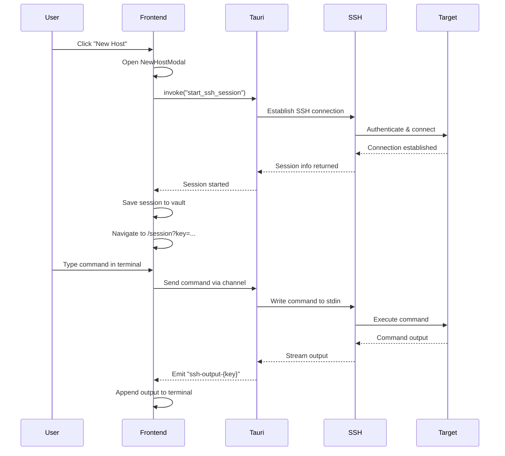
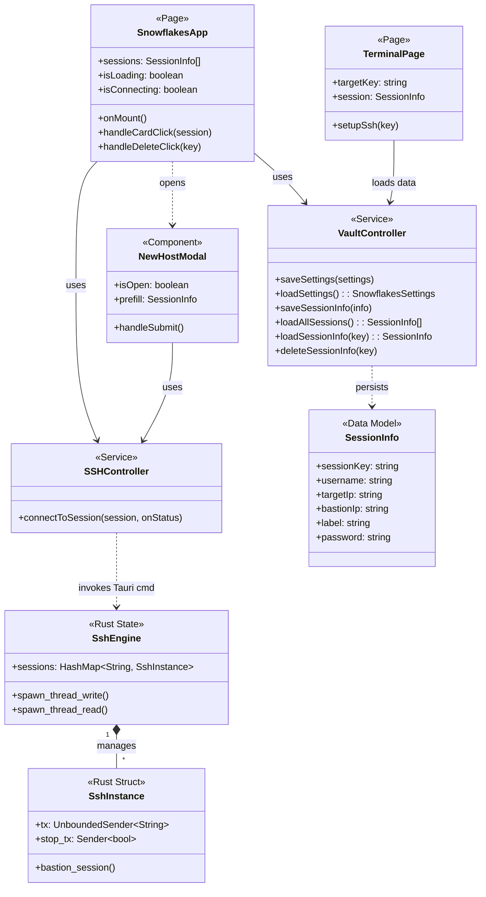

```mermaid
sequenceDiagram
participant User
participant Frontend
participant Tauri
participant SSH
participant Target

User->>Frontend: Click "New Host"
Frontend->>Frontend: Open NewHostModal
Frontend->>Tauri: invoke("start_ssh_session")
Tauri->>SSH: Establish SSH connection
SSH->>Target: Authenticate & connect
Target-->>SSH: Connection established
SSH-->>Tauri: Session info returned
Tauri-->>Frontend: Session started
Frontend->>Frontend: Save session to vault
Frontend->>Frontend: Navigate to /session?key=...

User->>Frontend: Type command in terminal
Frontend->>Tauri: Send command via channel
Tauri->>SSH: Write command to stdin
SSH->>Target: Execute command
Target-->>SSH: Command output
SSH-->>Tauri: Stream output
Tauri-->>Frontend: Emit "ssh-output-{key}"
Frontend->>Frontend: Append output to terminal
``` 

```mermaid
classDiagram
    class SnowflakesApp {
        <<Page>>
        +sessions: SessionInfo[]
        +isLoading: boolean
        +isConnecting: boolean
        +onMount()
        +handleCardClick(session)
        +handleDeleteClick(key)
    }

    class VaultController {
        <<Service>>
        +saveSettings(settings)
        +loadSettings(): SnowflakesSettings
        +saveSessionInfo(info)
        +loadAllSessions(): SessionInfo[]
        +loadSessionInfo(key): SessionInfo
        +deleteSessionInfo(key)
    }

    class SSHController {
        <<Service>>
        +connectToSession(session, onStatus)
    }

    class NewHostModal {
        <<Component>>
        +isOpen: boolean
        +prefill: SessionInfo
        +handleSubmit()
    }

    class TerminalPage {
        <<Page>>
        +targetKey: string
        +session: SessionInfo
        +setupSsh(key)
    }

    class SshEngine {
        <<Rust State>>
        +sessions: HashMap~String, SshInstance~
        +spawn_thread_write()
        +spawn_thread_read()
    }

    class SshInstance {
        <<Rust Struct>>
        +tx: UnboundedSender~String~
        +stop_tx: Sender~bool~
        +bastion_session()
    }

    class SessionInfo {
        <<Data Model>>
        +sessionKey: string
        +username: string
        +targetIp: string
        +bastionIp: string
        +label: string
        +password: string
    }

    %% Relationships
    SnowflakesApp --> VaultController : uses
    SnowflakesApp --> SSHController : uses
    SnowflakesApp ..> NewHostModal : opens
    NewHostModal --> SSHController : uses
    TerminalPage --> VaultController : loads data
    SSHController ..> SshEngine : invokes Tauri cmd
    SshEngine "1" *-- "*" SshInstance : manages
    VaultController ..> SessionInfo : persists
```